# Loewy-DAQ
  
Visit our research group website: https://www.lehighloewyinstitute.org  

**Loewy-DAQ** Contains the work of Lehigh University Loewy Institute undergraduate researcher Nicholas Cheney on the development of a chatter monitoring / DAQ system for a 4-high rolling mill. This forms the basis of a project which will be iterated on by future students; the idea is to make use of signal processing in combination with the metal rolling process in order to detect, predict, and respond to incidences of chatter. 

"Guide for Next User" follows, below: 

---
# **Guide for Next User - Vibrational Analysis for a Four-High Rolling Mill**
### **Author**: Nicholas Cheney @nimch223  
### **Advisors**: Professor Wojtek Misiolek & Nick Rockwell @nmrockwell 
### **Document Last Updated On**: January 15, 2024

---

# **Table of Contents:**
+ **[Background](#background)**
+ **[I. Set Up Hardware](#i-set-up-hardware)**  
+ **[II. Download Software: MATLAB & Simulink](#ii-download-software-matlab--simulink)**  
+ **[III. Open & Configure Software](#iii-open--configure-software)**  
+ **[IV. Run Software](#iv-run-software)**  
+ **[V. Additional Information & Future Recommendations](#v-additional-information--future-recommendations)**  
+ **[Papers Referenced](#papers-referenced)**

---

## Background  
Using two ADXL345 accelerometers connected to an Adafruit METRO (a microcontroller that
is equivalent to the Arduino Uno), vibrational analysis of a four high rolling mill can be
performed. The two accelerometers in their housings are to be mounted on the upper backup
roll and top housing of the rolling mill in Whitaker 165.
  
 These two locations for the placement of
the accelerometers were chosen based on a literature review in which it was discovered that
the upper backup roll and top housing demonstrate a higher sensitivity to chatter, making them
ideal locations for the permanent installation of acceleration sensors [Niroomand et al. 864].
  
The accelerometers measure the vertical vibration of the mill for the presence of chatter, the
intense and undesirable vibration of the mill that can negatively impact the rollers and affect
the quality of the rolled material. The most destructive forms of chatter occur at the third and
fifth octave modes of vibration, 100 - 200 Hz and 500 - 700 Hz respectively [Choudhary et al.
1].   

At third octave chatter conditions, the rolled sample experiences poor surface finish quality
and variations in thickness, while at fifth octave chatter conditions the sample experiences
even worse surface finish, larger variations in thickness and potential rupture of the sample,
and the backup and work rolls can experience transverse bending. 

The goal in installing these
vibrational sensors on the rolling mill in Whitaker 165 is to better understand the relationship
between the vibration of a one-stand mill and the quality of rolled samples, and if chatter
occurs, catch it with live vibrational monitoring before it becomes destructive to the sample and
rolls. The following document goes through the process of procuring, manufacturing, and
setting up the hardware for the vibrational sensors, and walks through the steps of how to
configure and run the software for plotting the vibrational data from the two accelerometers. 

--- 

## I. Set Up Hardware  

The following components outline the hardware used to make the vibrational sensor. Included
are either the links of where to find and buy them, or the files where they can be located.  

Files located in Github, at the following location: https://github.com/nimch223/Loewy-DAQ

**1. Microcontroller:**  
- Adafruit METRO 
  - Link: https://www.adafruit.com/product/2488
- Clear Housing for METRO
  - Link: https://www.adafruit.com/product/3597?gad_source=1&gclid=Cj0KCQiAm
4WsBhCiARIsAEJIEzXbmyYK6P6f_sxl3pgHApCRhQQjLrS05EgrbCzs6rN
KPTvZjAyUd0QaAgsNEALw_wcB

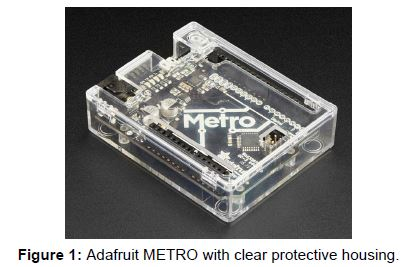  

**2. Accelerometers:**  
- (x2) Adafruit ADXL345 Accelerometers
  - Link: https://www.adafruit.com/product/1231  

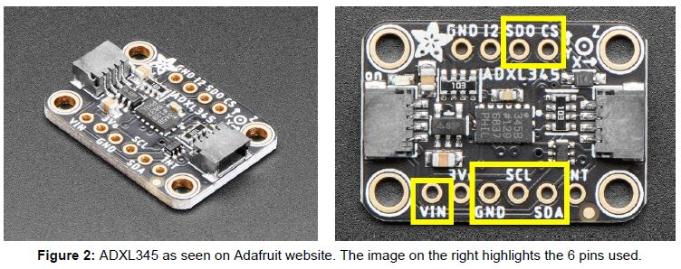   
 
- (x2) 3D-Printed Housing for ADXL345  
  - These housings were designed in SolidWorks to perfectly fit the ADXL345, as no
CAD files could be found online for the current ADXL345 accelerometer model.
Two housings were then printed out of PLA in Wilbur Powerhouse using the FDM
printers.

    - STL File (in this Github repo) for 3D printing: **ADXL345_housing.STL**
    - SolidWorks File (also in this Github repo)--if needed to edit: **ADXL345_housing.SLDPRT**  

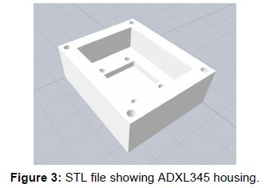  

- (x4) Screws needed to secure each ADXL345 in housing

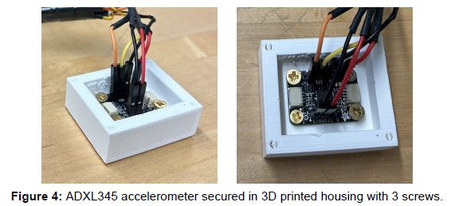    

**3. Printed Circuit Board (PCB):**  
- The PCB was designed in Autodesk EAGLE, a free and intuitive PCB design software.
The physical board was then manufactured in the Electronics Design Lab in Wilbur
Powerhouse using the Othermill V2 CNC Mill. Using the soldering iron in Wilbur, four
10kΩ resistors and break-away male headers were soldered onto the board, shown in
**Figure 6**.

    - Autodesk EAGLE Files (in this Github repository):
      - Schematic File: **PCB_for_ADXL345.sch**  
      - Board File: **PCB_for_ADXL345.brd**

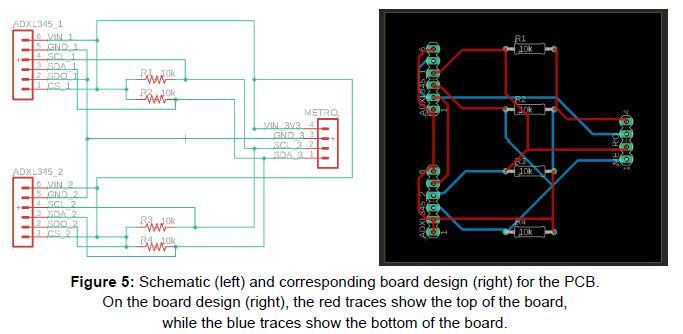  

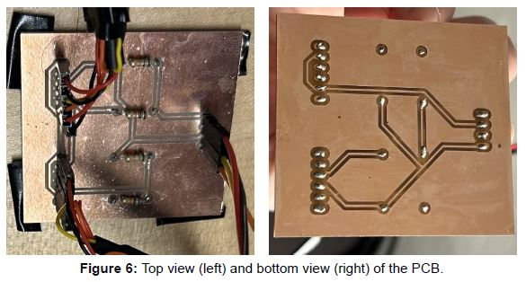  

**4. Wires / Cables:**
- (x4) female-to-male (F/M) jumper wires - used to connect the Arduino to one side of the PCB.
  - These can be seen in **Figure 7**, labeled "3".
    - Link: https://www.adafruit.com/product/1953?gad_source=1&gclid=Cj0KCQiAm4WsBhCiARIsAEJIEzUyF3oqaQGZTwtKFuOSnZRV7XU1m5S8ml8urbqnD2HHYeW__Y-boksaAtEdEALw_wcB

- (x2) female-to-female (F/F) cables.
  - Each cable is roughly 5.5 feet and has 6 female header contacts on each side. Each cable is used to connect the 6 pins on the ADXL345 accelerometer (highlighted in **Figure 2**) to the respective header
on the PCB (labeled "ADXL345_1" and "ADXL345_2" on the schematic in **Figure 5**).
These were spliced and made in the electronics lab in Wilbur Powerhouse.

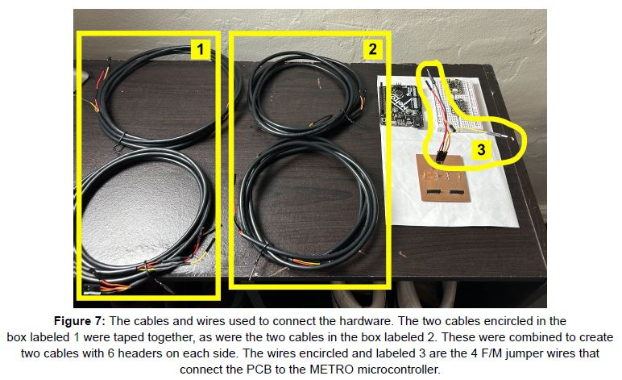  
  
---

## II. Download Software: MATLAB & Simulink  

1. Open the following link: https://matlab.mathworks.com/  
2. Click "Install MATLAB", located at the top right of the page.  
3. Double-click the ".dmg" file that is downloaded onto your ocmputer and follow the steps to finish installation. 
- When asked, install both "MATLAB" and "Simulink". 
- When "Installation Complete" message appears, if prompted, install a supported C compiler for your machine by clicking the link.
  - For Macintosh users, you need at least **Xcode 14.x**
    - For Apple users:
      - Visit https://developer.apple.com/download/more/ and sign into Apple ID.
      - In the search bar, look up "Xcode"
      - Download the most recent version, or the most recent version supported by your machine (for me, Xcode 14.2)
        - Check minimum requirements here: https://developer.apple.com/support/xcode/
      - Launch Xcode, install necessary elements.

---  

## III. Open & Configure Software  

1. Double-click MATLAB to open the program.
2. In the main MATLAB window, search the top toolbar for "Add-Ons" and double-click it to select it. This is highlighted below in **Figure 8**:

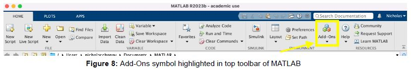  

3. The "Add-On Explorer" window should launch--use the search bar towards the top right, and search for "Arduino".
4. Pluf the microcontroller (METRO / Arduino) into the computer. Ensure it is getting power by making sure the onboard LED is lit.
5. Install the two support packages titled "Simulink Support Package for Arduino Hardware" and "MATLAB Support Package for Arduino Hardware" by clicking the respective titles, and selecting the "Add" blue button on the right side of the screen. Follow the instructions to download, and ensure that the microcontroller is recognized by the computer.
6. Once both support packages have been downloaded, they should have a green "Installed" message by their picture in the "Add-On Explorer", similar to the **Figure 9** below:  

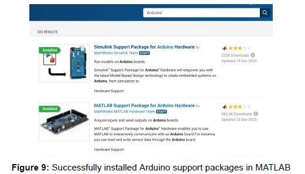  

7. Close the Add-On Explorer window.
8. In the main MATLAB window, search the top toolbar for "Simulink" and double-click it to launch. **Figure 10** below highlights the Simulink symbol in the toolbar:  

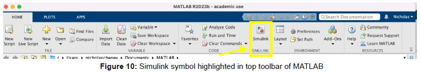  

9. A new Simulink window should open.
10. Download the file titled **"Two_ADXL345_accell.slx"** from Github, and open the file in the Simulink window. The code should appear similar to **Figure 11** below:

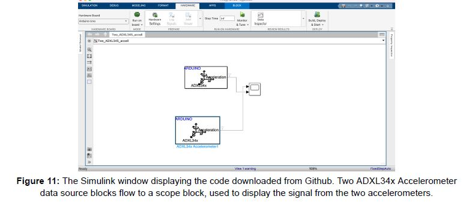  

11. In the Simulink window toolbar, verify that the following settings are configured as follows:
  - Under the "Simulation" tab, set "Stop Time" to "inf" (infinity)
  - Under the "Hardware" tab:
    - Select the "Hardware Board" dropdown menu, and click "Select Another Hardware Board". A "Configuration Parameters" window will appear, and in the "Hardware Implementation" tab, select the "Hardware board:" dropdown meny and select "Arduino Uno". Click "Apply" at the bottom right, then click "OK".
    - Ensure that the mode "Run on board" is selected.
    - Click on "Hardware Settings", and a "Configuration Parameters" window will appear. In the "Hardware Impplementation" tab, select the dropdown menu titled "Target hardware resources" nested in "Hardware board settings". Under the "Groups" ttle, select the "Host-board connection" tab.
    - Open your computer's terminal and type the following command:  
      `ls/vex/tty.*`
      This lists all the serial devices plugged into the computer. The Metro/Arduino should appear as the two serial ports:
      `/dev/tty.SLAB_USBtoUART` and `/dev/tty.usbserial-01C6018D`
      ...the latter, ending with "...018D", is the important one.
    - In the same "Host-board connection" tab, click the dropdown menu for "Set host COM port" and select "Manually select". Directly beneath in the "Host COM Port" dropdown, select `/dev/tty.usbserial-01C6018D/`. Ensure that it is the **`/dev/tty...`** selection and *NOT* the similarly named `/dev/cu...`.
    - Under the same "Groups" title, select the last tab, titled "External mode". Ensure the "Communication interface" dropdown selection is "XCP on Serial".

---  
## IV. Run Software  

1. Navigate back to the MATLAB main window.  
2. Type the following code into the editor window, labeled in Figure 12 below as (1), and then click "Run" labaled as (2):
    
```matlab
% MATLAB commands:
clear all;
clc;
clear a;
a = arduino; 
```

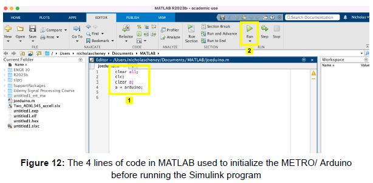  

3. Navigate back to the Simulink window and click "Monitor & Tune" at the top.
4. The code will take some time to run; if it runs successfully, a "Stop" option will appear in the "Hardware" tab of the top toolbar, and "Data Inspector" to the right of it.
5. Click on Data Inspector and a "Simulation Data Inspector" window will appear. Initially, the data coming from the two accelerometers may be displayed on a single graph as 6 lines: "x", "y", and "z" data from each accelerometer.
6. To split the data from the two different accelerometers into two graphs, click the window icon, shown below in Figure 13 as the box highlighted and labeled as (1). Next, under "Basic layouts", select the option with a graph above and below, labeled (2) in **Figure 13** below:

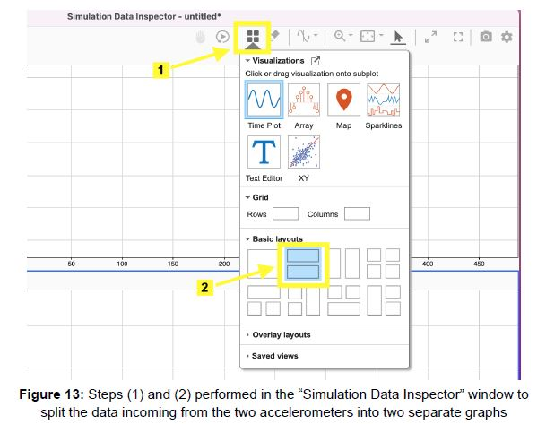  

7. Click the top graph, which is outlined in blue in Figure 14. Under the "Filter signals" dropdown menu on the left, select the checkbox of the 3rd signal from the 1st accelerometer. Ensure that all other signals are deselected. The "Simulation Data Inspector" window should appear in **Figure 14** below:

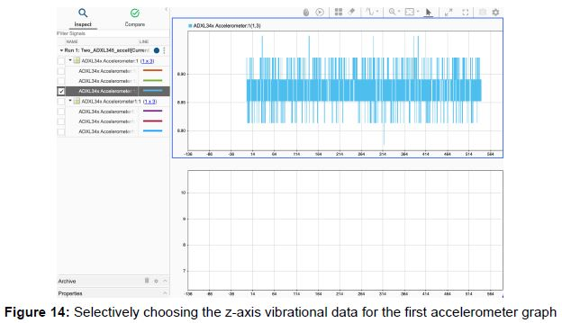  

8. Click the bottom graph, then under the "Filter signals" dropdown menu on the left, select the checkbox of the 3rd signal from the 2nd accelerometer. Ensure that all other signals are deslected. The "Simulation Data Inspector" window should appear like **Figure 15** below:

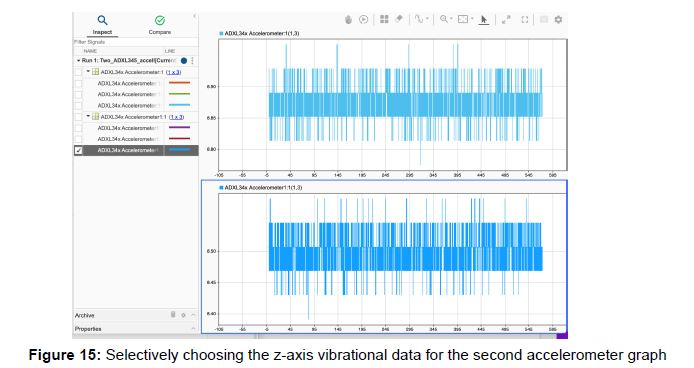  

9. Steps "7" and "8" ensure that only the z-axis (vertical) signal from each accelerometer is graphed. The two running graphs should now display vertical vibrational data from each accelerometer.
10. When finished with measuring the vibrational data, go to the Simulink window and click "Stop" in the toolbar.
11. To save the data from the graphs, go back to the "Simulation Data Inspector" window, and select the "Export" symbol on the left toolbar, shown in **Figure 16** below:

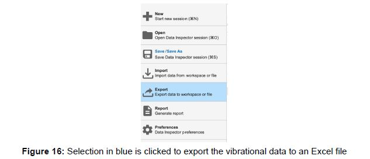  

12. In the "Export" settings window:
    - For "Export:", choose to export only the "Selected runs and signals" for export.
    - For "To:", export the data as an Excel Workbook ".xlsx" file
    - Once the file is exported, the data should appear in your computer under the "MATLAB" folder, wherever that is located.  
  
---  
## V. Additional Information & Future Recommendations  

- The current Simulink code here on Githbu (**Two_ADXL345_accell.slx**) is relatively simple. As displayed in **Figure 11**, it is composed of two accelerometer data source blocks. These blocks are connected to a scope block, which allows for real time data visualization and the real time plotting of the vibrational data.
- These data source blocks are configured so that each block matches the respective I2C address of each accelerometer: **0x1D** and **0x53**.
  - The two accelerometers hooked up in the circuit are recognized under different addresses because one accelerometer's **SDO** pin is connected to **GND**, while the other accelerometer's **SDO** pin is not. This can be seen in **Figure 5** (the PCB schematic).
  - Double-click each accelerometer data source block to display these addresses
  - Double-clicking these blocks also displays additional parameters for the accelerometers that can be set. These parameters include important factors such as the range of acceleration that the accelerometers can measure, and the accelerometer output data rate. *These parameters should be adjusted based on further research and needs*.
  - For example, the accelerometer output data rate is automatically set at 12.5 Hz, which is not high enough for fast and accurate data streaming. The data rate can be adjusted to as high as 1600 Hz.
- This information regarding how the wiring of the pins should be configured in order to communicate with two accelerometers under two different I2C addresses was found in the ADXL345 data sheet. This data sheet, along with the Adafruit ADXL345 website that has pinout, wiring guides, example code, and more, are extremely informative and useful for understanding the capabilities and limitations of the accelerometers. The links are below:
  - ADXL345 Data Sheet: https://www.analog.com/media/en/technical-documentation/data-sheets/adxl345.pdf
 
  - ADXL345 webpage listing: https://learn.adafruit.com/adxl345-digital-accelerometer/overview  

- The need for additional processing, filtering, or denoising of the data may be discovered in the future. The MATLAB and Simulink software was chosen due to it being relatively simple, visual, and intuitive, and an easy base to build off of.
- In order to perform this additional data processing in Simulink, extra blocks would be added to the current Simulink model.
  - Based on the processing needs, pre-built data filtering blocks can be selected from Simulink's library.
  - These filtering blocks can be easily inserted between the accelerometer data source blocks and scope blocks--some examples of filter blocks that can be added are:
    - High pass filter block
    - Automatic gain control block
    - Low pass filter block
  - From the literature review, the aforementioned filters are recommended for data processing [Niroomand et al. 857]. **Figure 17** below shows a potential block diagram for data signal filtering and processing:
 
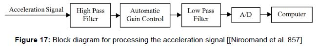  
 
  - The process for the ADXL345 accelerometer would be similar to the process shown in **Figure 17** bit slightly different, as the accelerometers have a built in ADC, or "Analog to Digital (A/D) Converter".     
---  

## Papers Referenced  

1. Choudhary et al. “A Review on Chatter Analysis in Cold Rolling process.” Juniper Online
Journal Material Science, vol. 2, issue no. 1, 2017, page 1, ISSN 2575-856X.  

2. Niroomand et al. “Frequency analysis of chatter vibrations in tandem rolling mills.” Journal of
Vibroengineering, vol. 14, issue no. 2, 2012, pages 857 - 864, ISSN 1392-8716.

---
